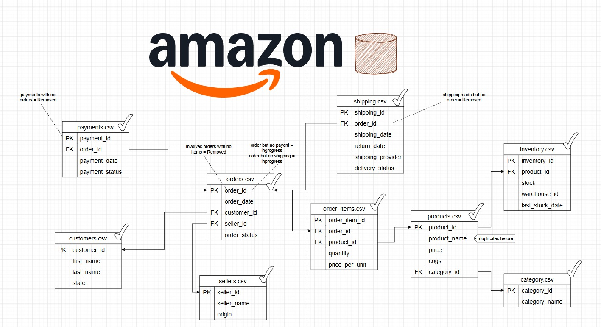

# 🛒 Amazon E-Commerce Data Analytics

An end-to-end SQL data analytics project built on Amazon-style e-commerce data, covering **customers, orders, products, payments, shipping, sellers, and inventory**.

## 📊 Data Model

## 🔍 Business Analysis

Solved **17 advanced business-level questions** using SQL techniques such as:

- Window Functions
- CTEs
- Subqueries
- Joins & Aggregations

The analysis covers **sales performance, sellers, orders, payments, shipping, products, and inventory**.

## 🛠️ Tech Stack

**SQL · PostgreSQL · Snowflake Schema · Window Functions · CTEs · Subqueries**
